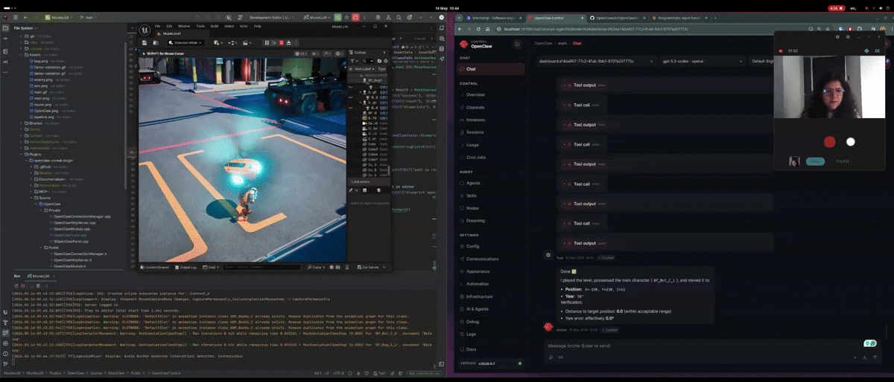

# Humanoid Challenge - Software Engineering

***Demo 1: World state querying: the agent counts all instances of a specific Blueprint object in the level in real time***
(https://drive.google.com/file/d/1yCiU0ErI--wYDydDgTGZUlIBayBf9atg/view?usp=drive_link)


This solution uses Unreal Engine 5 as the environment where the 3D world lives, OpenAI 5.3 as the LLM “brain” of the agents, and OpenClaw as the agent platform.
To connect Unreal Engine and OpenClaw, I used the OpenClaw Unreal plugin available in the following repository:
https://github.com/TomLeeLive/openclaw-unreal-plugin

## Pipeline and design choices


- **Unreal Engine:** It is the standard software for real‑time applications, and it has also become very popular in robotic simulation environments thanks to its ability to simulate photorealistic environments, an aspect that is especially valuable when training robots in simulation.
- **OpenAI 5.3:**  I’ve been experimenting with LLMs for a couple of months, testing everything from local models to cloud solutions like DeepSeek, Claude Opus, and OpenAI. So far, in my experience, OpenAI’s models have delivered the most consistent and reliable results. Because of that, I consider OpenAI 5.3 a strong and affordable “brain” for this task.
- **OpenClaw:** In parallel with my LLM experimentation, I’ve been using OpenClaw for personal tasks, and I’m genuinely amazed by what it enables. The platform makes it surprisingly easy to build powerful agent workflows, and it has consistently delivered results.
- **OpenClawUE:** The bridge between Unreal Engine and OpenClaw through an MCP connection.

## Project Spectations 
### virtual environment

The assets used to generate the next level were taken from FAB. They are open‑source, and the link to the author’s original source is: https://www.fab.com/listings/709924e0-3128-4d23-9d36-fe35991d03c0

### Characters

| Muxie (main Agent) | Bug (target) |
|--------------------|--------------|
|  |  |

### Goal Task

The agent must be able to start the editor, access the main character, and call the appropriate action functions to move the character toward the target bug and eliminate it autonomously. Through the MCP connection, the agent has access to a set of tools it can select and execute as needed. The task is considered successful once the agent kills at least one bug, demonstrating that it can navigate, act, and time its jump correctly.

### Agent Current State

The agent's current state is observed through the OpenClaw UI, which displays
in real time the tools being called, the decisions being made, and the
actions being executed in the Unreal Editor.

### Actions

To interact with the world, the agent needs to:

1. Start the editor in Play mode to spawn  (BP_Bot).
2. Navigate the world using the following actions than simulate w,a,s,z keyboard inputs. 

- `MoveForward`
- `MoveBackward`
- `MoveLeft`
- `MoveRight`
- `Jump`

### Kill Mechanic
Bugs are eliminated when Muxie jumps on top of the bug’s target point. This means the agent must determine the correct moment to jump in order to collide accurately.

- When the collision is successful: A confetti effect is triggered and the bug disappears from the world
- When the collision fails: Muxie turns red to indicate an incorrect jump

### LLM

The brain of the agent is the GPT-5.3-codex of OpenAI.  It was chosen for its strong reasoning results and competitive pricing per million tokens.

### Goal Validation

***Example of human‑driven actions achieving the goal***


***Demo of the agent-driven actions "achieving" the goal***


### Instructions to Run the System

This setup requires the following running simultaneously:

1. **Unreal Engine 5.6**
2. **OpenClaw** running either via Docker container or installed locally on your machine
3. **Rider, VSCode, or Visual Studio** as the IDE to work with Unreal Engine

>Note: I'm aware this setup is not easy to replicate, but I chose to use the best tools and frameworks available in production-grade environments :)

#### Linux Installation

```bash
# Clone the repository
git clone https://github.com/DanielaHz/Muxie-An-LLM-Agent-in-Unreal-Engine-5.git
cd Muxie-An-LLM-Agent-in-Unreal-Engine-5

# to open project with Rider or vscode
rider .
code .
```

### Experimentation (what works and what not)

#### 1. Natural language prompt with limited context
(https://drive.google.com/file/d/1l3n5s2sVqWyjfvs4_4F7SIFEXLEMT0Zs/view?usp=drive_link)
```
The agent receives a simple instruction in natural language with minimal information about the environment, available tools, or expected outcome.
- Input: Play the Editor level. Once the main character has been spawned, possess it and move it to position X=-330, Y=230, Z=52. The target yaw rotation should be 58°. The task is complete when the character is within an acceptable range of the target position.
- Output: The agent cloned the Blueprint of the main character at the position provided in the input instructions, but it did not move the actual main character as expected
- Comment: The provided input is insufficient to achieve the intended outcome.
```

2. Natural language prompt with full context

```
Input: Play the Editor level. Your goal is to reach the position X=-330, Y=230, Z=52, where a Bug target is located. Navigate autonomously using the MoveForward, MoveBackward, MoveLeft and MoveRight tools. Repeat until the distance to the target is less than 5 units in both the X and Y axes. Once you are within that range, call the Jump tool followed by MoveForward to kill the Bug.
Output: The agent managed to reach the position and collide with the object in the Blueprint, but did not kill it as expected.
Comment: It is surprisingly a good result, as it managed to move to the position specified even he does not kill the bug
```

### Notes
- If you don't give the agent access to the current state — at least its position — you can inject movement functions, but it won't recognize where it is in the 3D world. Therefore, returning the current position is essential for navigating the world properly.
- Agents don't have perception of time, so the exposed tools somehow have to include a delay to let the Editor render and run in a more "human-like" manner.