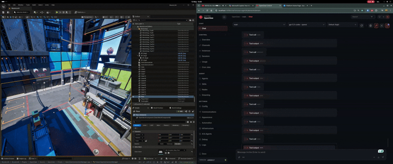
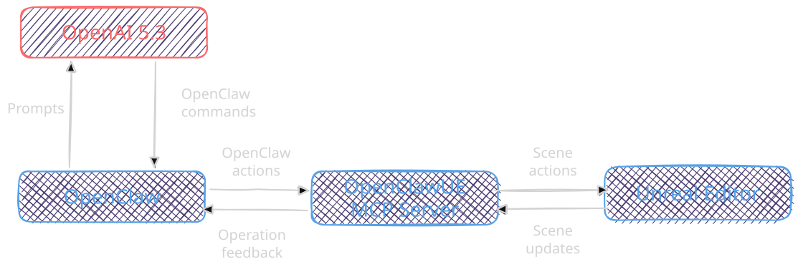
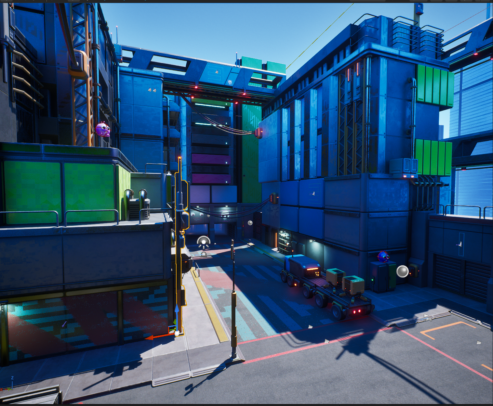
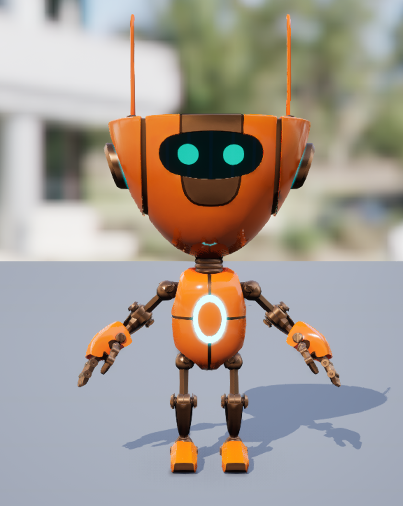
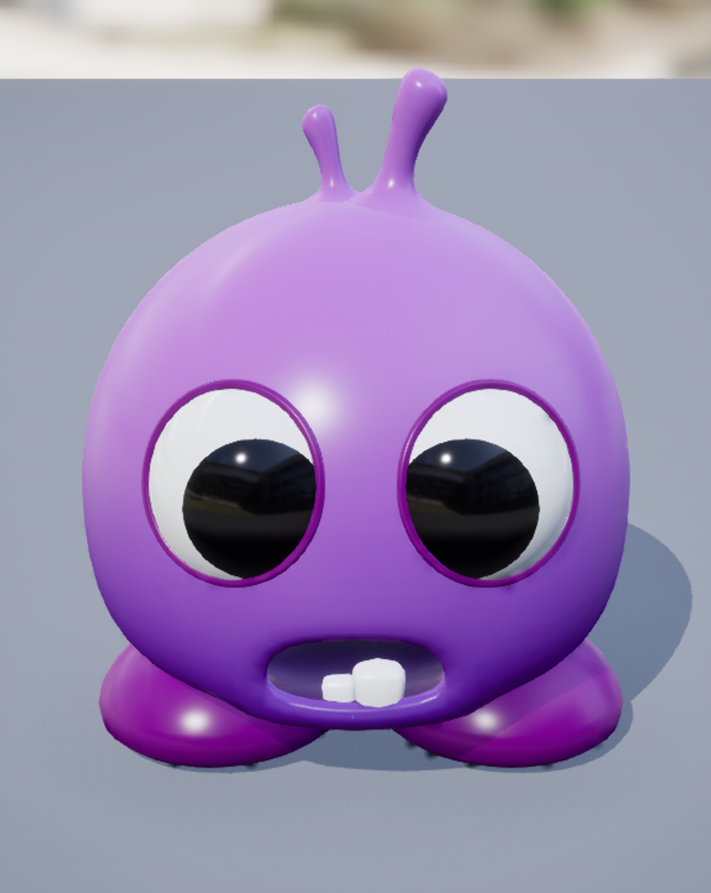

# Humanoid Challenge - Software Engineering



This solution uses Unreal Engine 5 as the environment where the 3D world lives, OpenAI 5.3 as the LLM “brain” of the agents, and OpenClaw as the agent platform.
To connect Unreal Engine and OpenClaw, I used the OpenClaw Unreal plugin available in the following repository:
https://github.com/TomLeeLive/openclaw-unreal-plugin

## Pipeline



- **Unreal Engine:** It is the standard software for real‑time applications, and it has also become very popular in robotic simulation environments thanks to its ability to simulate photorealistic environments, an aspect that is especially valuable when training robots in simulation.
- **OpenAI 5.3:**  I’ve been experimenting with LLMs for a couple of months, testing everything from local models to cloud solutions like DeepSeek, Claude Opus, and OpenAI. So far, in my experience, OpenAI’s models have delivered the most consistent and reliable results. Because of that, I consider OpenAI 5.3 a strong and affordable “brain” for this task.
- **OpenClaw:** In parallel with my LLM experimentation, I’ve been using OpenClaw for personal tasks, and I’m genuinely amazed by what it enables. The platform makes it surprisingly easy to build powerful agent workflows, and it has consistently delivered results.
- **OpenClawUE:** The bridge between Unreal Engine and OpenClaw through an MCP connection.

## Project Spectations 
### virtual environment

The assets used to generate the next level were taken from FAB. They are open‑source, and the link to the author’s original source is: https://www.fab.com/listings/709924e0-3128-4d23-9d36-fe35991d03c0

### Characters

| Muxie (main Agent) | Bug (target) |
|--------------------|--------------|
|  |  |

### Goal Task
The agent should be able to start the editor and navigate Muxie in the world, killing bugs autonomously. The muxie
can kill the bugs its jumping on the bug.

### Agent Current State

The agent's current state is observed through the OpenClaw UI, which displays
in real time the tools being called, the decisions being made, and the
actions being executed in the Unreal Editor.

Additionally, the `get_world_state` tool provides the agent with structured
information about its surroundings, including:

- Current position and rotation in the world
- Nearby bugs and their directions
- Number of bugs collected so far
- Total bugs remaining in the world

### Actions

To interact with the world, the agent needs to:

1. Start the editor in Play mode to spawn Muxie.
2. Navigate the world using the following actions:

- `move_forward`
- `move_backward`
- `move_left`
- `move_right`
- `jump`
- `rotate_view_camera`
- `detect_bug`

### Collection Mechanic
Bugs are collected automatically when Muxie jump over the bugs and colide with the mesh.
A confetti effect spawns and the bug disappears from the world.

### LLM

The brain of the agent is the GPT-5.3-codex of OpenAI.  It was chosen for its strong reasoning results and competitive pricing per million tokens.

### Goal Validation

TODO: The Demo of the agent completing the task

### Instructions to Run the System

This setup requires the following running simultaneously:

1. **Unreal Engine 5.6**
2. **OpenClaw** running either via Docker container or installed locally on your machine
3. **Rider, VSCode, or Visual Studio** as the IDE to work with Unreal Engine

#### Linux Installation with Rider

```bash
# Clone the repository
git clone https://github.com/DanielaHz/Muxie-An-LLM-Agent-in-Unreal-Engine-5.git
cd Muxie-An-LLM-Agent-in-Unreal-Engine-5

# Open the project in Rider
rider .
```

> **Note:** The OpenClaw plugin is already included in this repository.

### Inputs and outputs

### Design choices 

